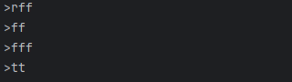

# Kafka Spring Boot Docker Demo Project

This repository contains a demo project that showcases how to integrate **Spring Boot**, **Apache Kafka**, and **Docker** to build a streaming data analytics application.

## Introduction

This project demonstrates the use of Apache Kafka with Spring Boot for building real-time data streaming applications. The application includes:

- Kafka Producer
- Kafka Consumer
- Kafka Streams processing
- Visualization of Kafka Streams data

By containerizing the application and Kafka components using Docker, we simplify the setup and ensure consistency across different environments.

## Project Structure

```
demo-spring-kafka/
├── src/
│   ├── main/
│   │   ├── java/
│   │   │   └── ma/
│   │   │       └── enset/
│   │   │           └── demospringkafka/
│   │   │               ├── entities/
│   │   │               │   └── PageEvent.java
│   │   │               ├── processors/
│   │   │               │   └── StreamDataAnalyticService.java
│   │   │               ├── serializers/
│   │   │               │   ├── CustomDeSerializer.java
│   │   │               │   └── CustomSerializer.java
│   │   │               ├── services/
│   │   │               │   ├── AppSerdes.java
│   │   │               │   └── PageEventService.java
│   │   │               ├── web/
│   │   │               │   └── PageEventController.java
│   │   │               └── DemoSpringKafkaApplication.java
│   │   └── resources/
│   │       └── application.yml
├── docker-compose.yml
└── README.md
```

## Prerequisites

- Java 17 or later
- Maven
- Docker and Docker Compose
- An IDE like IntelliJ IDEA or Eclipse

## Getting Started

### Docker Setup

The `docker-compose.yml` file sets up the necessary Kafka and Zookeeper services using Docker.

**docker-compose.yml:**

```yaml
version: '3'
services:
  zookeeper:
    image: confluentinc/cp-zookeeper:latest
    container_name: zookeeper
    environment:
      ZOOKEEPER_CLIENT_PORT: 2181
      ZOOKEEPER_TICK_TIME: 2000

  broker:
    image: confluentinc/cp-kafka:latest
    container_name: broker
    ports:
      - "9092:9092"
    depends_on:
      - zookeeper
    environment:
      KAFKA_BROKER_ID: 1
      KAFKA_ZOOKEEPER_CONNECT: 'zookeeper:2181'
      KAFKA_LISTENER_SECURITY_PROTOCOL_MAP: PLAINTEXT:PLAINTEXT,PLAINTEXT_INTERNAL:PLAINTEXT
      KAFKA_ADVERTISED_LISTENERS: PLAINTEXT://localhost:9092,PLAINTEXT_INTERNAL://broker:29092
      KAFKA_OFFSETS_TOPIC_REPLICATION_FACTOR: 1
      KAFKA_TRANSACTION_STATE_LOG_MIN_ISR: 1
      KAFKA_TRANSACTION_STATE_LOG_REPLICATION_FACTOR: 1
```

To start the Kafka and Zookeeper services, run:

```bash
docker-compose up -d
```

This command will pull the necessary images and start the services in detached mode.

<details>
<summary>Sample Output</summary>

```
[+] Running 17/17
 ✔ broker 13 layers [⣿⣿⣿⣿⣿⣿⣿⣿⣿⣿⣿⣿⣿]      0B/0B      Pulled                                   658.2s
 ✔ zookeeper 2 layers [⣿⣿]      0B/0B      Pulled                                  658.4s
[+] Running 2/2
 ✔ Container zookeeper                Started                                        3.6s
 ✔ Container broker                   Started
```

</details>

### Running the Application

Build and run the Spring Boot application using Maven.

Alternatively, you can build a Docker image for the Spring Boot application and run it as a container.

## Kafka Tests

### Producer Only

This test simulates a Kafka producer that publishes messages to a specific topic.

To produce messages to topic `R2`:

```bash
docker exec -it broker kafka-console-producer --bootstrap-server broker:9092 --topic R2
```

Enter your messages in the console.



### Consumer Only

This test simulates a Kafka consumer that listens to messages from a specific topic.

To consume messages from topic `R2`:

```bash
docker exec -it broker kafka-console-consumer --bootstrap-server broker:9092 --topic R2 --from-beginning
```


### Producer and Consumer

This test runs both a producer and a consumer. The producer sends messages to a topic, and the consumer listens to the topic, receiving and processing the messages.

#### Producer sends messages:


#### Consumer transforms and produces messages:


To list all Kafka topics:

```bash
docker exec -it broker kafka-topics --bootstrap-server broker:9092 --list
```

Sample output:

```
R2
R66
__consumer_offsets
```

### Kafka Streams Processing

This test demonstrates Kafka Streams processing, where streams of data are processed in real-time.

#### First Stream Processing:


#### Second Stream Processing:


Consume and process messages from topic `R66`:

```bash
docker exec -it broker kafka-console-consumer --bootstrap-server broker:9092 --topic R66 --property print.key=true --property print.value=true --property key.deserializer=org.apache.kafka.common.serialization.StringDeserializer --property value.deserializer=org.apache.kafka.common.serialization.LongDeserializer
```

#### Using Endpoint:


### Streaming Visualization

You can visualize the streaming data using a web UI.


Access the visualization at:

```
http://localhost:8090
```

## Endpoints

The application exposes several REST endpoints:

- **Publish Events:** `GET /publish/{topic}/{name}`
  - Publishes a `PageEvent` to the specified Kafka topic.

- **Analytics:** `GET /analytics`
  - Streams aggregated analytics data.

- **Analytics with Windows:** `GET /analyticsWindows`
  - Streams windowed analytics data.

- **Aggregate Analytics:** `GET /analyticsAggregate`
  - Streams aggregated analytics data over a time window.

## Visualizing the Data

The application includes real-time data visualization using libraries like `smoothie.js`.

Access the visualization at:

```
http://localhost:8090
```


## References

- [Spring for Apache Kafka Documentation](https://docs.spring.io/spring-kafka/docs/current/reference/html/)
- [Apache Kafka Official Documentation](https://kafka.apache.org/documentation/)
- [Docker Official Documentation](https://docs.docker.com/)
- [Confluent Platform Docker Images](https://docs.confluent.io/platform/current/installation/docker/)